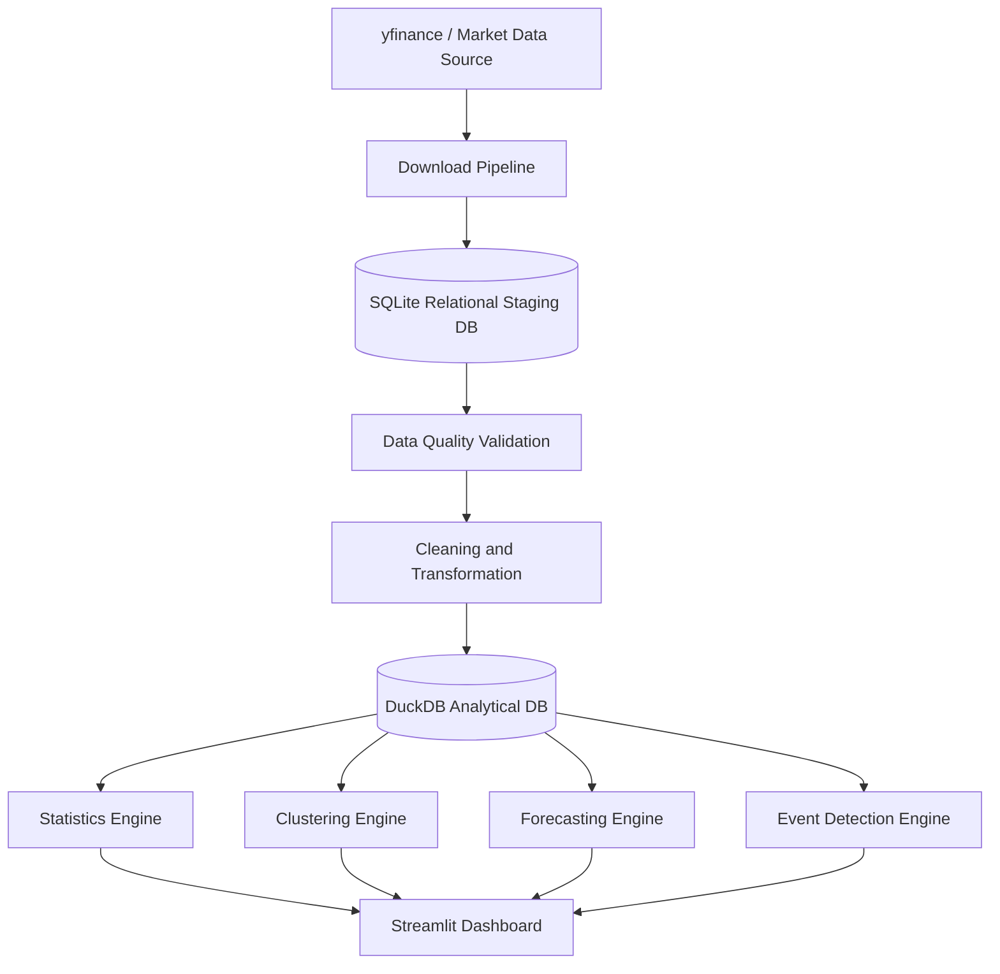

# AI Macro Market Intelligence Dashboard

Educational Python + Streamlit data platform for analysing public companies, ETFs, futures and commodities linked to artificial intelligence, semiconductors, precious metals, fuels/energy and transport/logistics.

> This project is an educational and analytical tool. It is not financial advice. Forecasts are uncertain scenarios based on historical assumptions.

## Business Objective

The dashboard helps compare assets by region, sector and risk profile, detect large gains/losses, cluster similar market behaviour and build scenario forecasts for the next 1 to 7 years.

Regions supported:

- Americas
- EMEA
- Asia
- Global

## Why This Project Is Useful

It demonstrates a realistic local analytics architecture instead of a single Streamlit script. Raw market data is auditable in SQLite, validated and cleaned, then transformed into DuckDB marts for fast analysis and dashboard consumption.

## Data Architecture: Relational Staging To Analytical DuckDB

This project follows a layered data architecture:

1. Relational staging layer: stores raw downloaded market data with traceability.
2. Data quality layer: validates missing values, duplicates, anomalies and failed downloads.
3. Analytical layer: stores cleaned and modelled data optimized for analysis.
4. Consumption layer: Streamlit dashboard for exploration, forecasting and monitoring.

This makes the project closer to a real data engineering and data science platform instead of a simple dashboard script.



## Stack

- Python
- Streamlit
- yfinance
- pandas and numpy
- scikit-learn
- statsmodels
- scipy
- plotly
- SQLite
- DuckDB
- SQLAlchemy-ready structure
- pytest

## Installation

```bash
cd AI_Macro_Market_Intelligence_Dashboard
python3 -m venv .venv
source .venv/bin/activate
pip install -r requirements.txt
```

## How To Run

```bash
streamlit run app.py
```

Open the Home page and click **Refresh market data**. The refresh runs:

```text
yfinance download
-> SQLite relational staging
-> data quality logs
-> cleaning and transformation
-> DuckDB analytical database
-> analytical marts
-> Streamlit pages
```

## How To Refresh Data

Use the sidebar refresh button. The app creates a new `download_batch`, stores raw data in `data/relational_market.db`, logs failed tickers and quality warnings, then rebuilds `data/analytics_market.duckdb`.

If a ticker fails:

- The app does not crash.
- The failed ticker is logged in SQLite.
- Valid tickers continue through the pipeline.
- The refresh status reports success, partial success or failed.

## How To Add New Assets

Edit:

```text
config/assets.yaml
```

Add tickers under the relevant sector and region. The next refresh reads this YAML file automatically.

## SQLite Relational Layer

`data/relational_market.db` is the audit and staging database. It stores:

- `dim_asset`
- `dim_sector`
- `dim_region`
- `download_batch`
- `market_price_raw`
- `data_quality_log`
- `failed_ticker_log`

Raw downloaded records remain in SQLite for traceability.

## DuckDB Analytical Layer

`data/analytics_market.duckdb` contains only clean and transformed analytical tables:

- `fact_market_prices`
- `fact_daily_returns`
- `fact_monthly_returns`
- `fact_asset_features`
- `fact_detected_events`
- `mart_asset_performance`
- `mart_regional_performance`
- `mart_sector_performance`
- `mart_forecasting_input`
- `mart_clustering_input`

Streamlit reads from DuckDB, not directly from yfinance or raw SQLite tables.

## Dashboard Pages

- Home: refresh status, KPI cards, performance overview and data quality/audit logs.
- Market Overview: sector and region comparison, correlation heatmap, cumulative returns and volume.
- Asset Explorer: price, returns, moving averages, volatility, drawdown, volume and key statistics.
- Statistical Analysis: distributions, correlation, PCA, risk-return map and group comparisons.
- Clustering: KMeans and Agglomerative clustering with PCA visualization and cluster profiles.
- Forecasting: baseline, exponential smoothing, ARIMA, random forest and Monte Carlo scenarios.
- Big Gains and Losses Stream: event timeline, severity cards and event table.
- Regional Comparison: equal-weighted regional indices, winners, losers and sector comparison.

## Statistical Methods

- Simple returns and log returns
- Cumulative returns
- Annualized return and volatility
- Sharpe ratio and Sortino ratio
- Maximum drawdown
- Rolling volatility
- Beta and correlation versus benchmark
- Skewness and kurtosis
- Value at Risk 95%
- Conditional Value at Risk 95%
- Normality and autocorrelation tests
- PCA

## Clustering Methods

The clustering page uses standardized features with:

- KMeans
- Agglomerative clustering
- PCA for 2D visualization
- Silhouette score
- Cluster profile interpretation

Example interpretations include high growth/high volatility, defensive/lower volatility, commodity-sensitive, and diversifier behaviour.

## Forecasting Methods

Forecasts use monthly data for long-term horizons:

- Historical average return
- Moving average trend
- Exponential smoothing
- ARIMA
- Random forest regression
- Monte Carlo simulation

Forecasts include uncertainty bands and model metrics where available. They are scenario-based, not predictions.

## Event Detection Logic

The event engine detects:

- Daily big gains and losses
- Weekly big gains and losses
- New 52-week highs and lows
- Large volume spikes
- Volatility spikes
- Drawdown alerts
- Strong rebounds

Events are stored in `fact_detected_events` in DuckDB.

## Portfolio Skills Demonstrated

Data Engineering:

- Data ingestion
- Relational staging
- Data quality checks
- Analytical modelling
- ETL pipeline design
- SQLite
- DuckDB
- Modular architecture

Data Analysis:

- Exploratory data analysis
- Returns analysis
- Risk analysis
- Regional comparison
- Sector comparison
- Market event analysis

Data Science:

- Clustering
- PCA
- Forecasting
- Backtesting-ready modelling
- Monte Carlo simulation
- Machine learning regression

Financial Analytics:

- Volatility
- Drawdown
- Sharpe ratio
- Sortino ratio
- VaR
- CVaR
- Benchmark comparison
- Asset grouping

## Testing

```bash
pytest
```

Tests cover return calculations, drawdown, Sharpe ratio, data quality checks, clustering preparation, forecasting input and pipeline status output.

## Limitations

- yfinance data availability varies by ticker, exchange and region.
- Futures, ETFs and equities have different trading calendars and liquidity profiles.
- Forecasts are based on historical relationships and can break under regime changes.
- Corporate actions, currencies and survivorship bias require deeper treatment for production use.

## Future Improvements

- PostgreSQL staging option
- dbt-style SQL transformation layer
- Currency normalization
- More robust backtesting engine
- Scheduled refresh
- Authentication and deployment
- More granular factor models
